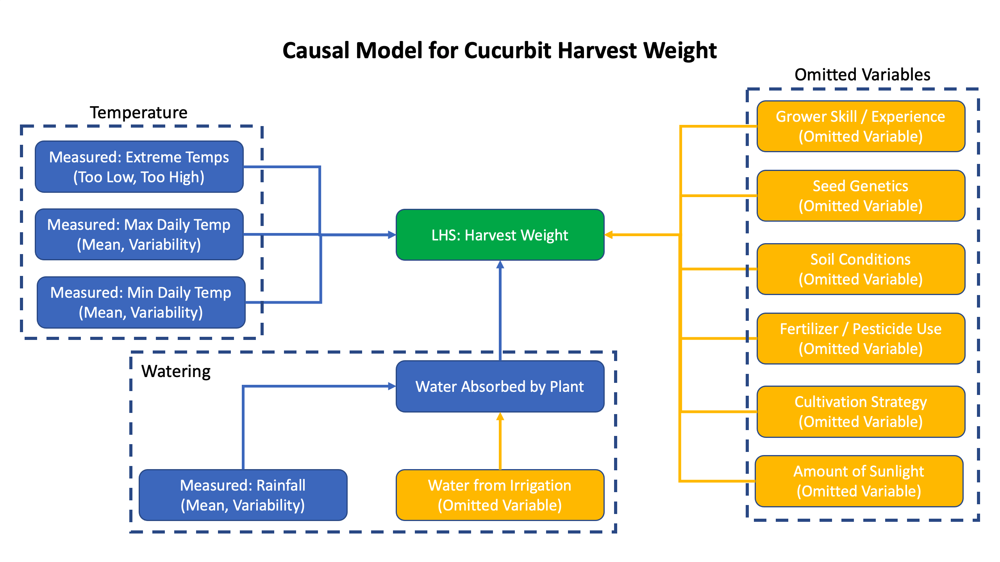
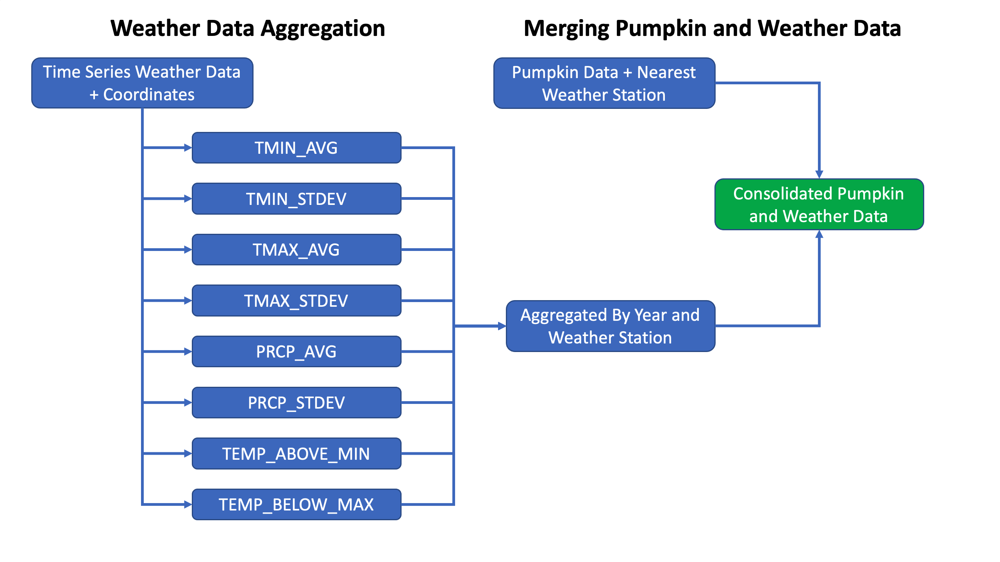
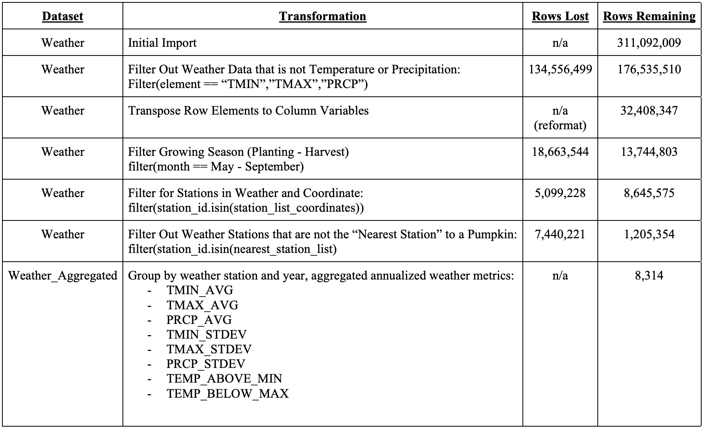
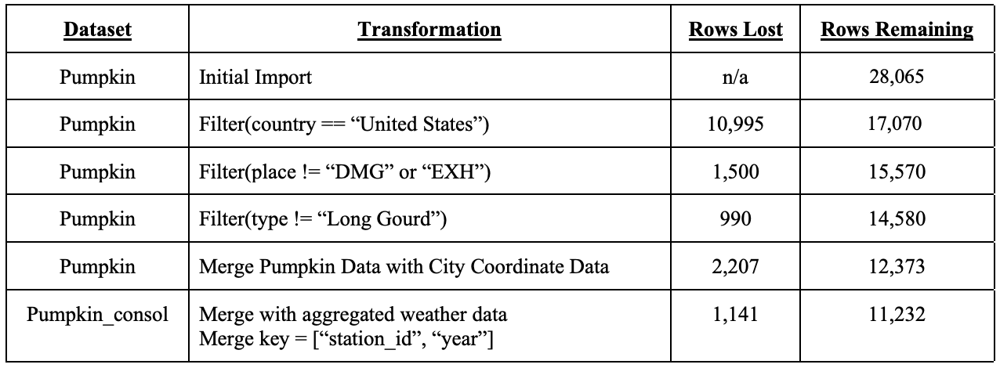

## 1. An Introduction

Giant Pumpkin competitions have grown in popularity over time and have evolved into a highly competitive sport among farmers with substantial cash prizes and even an organizing body called the Great Pumpkin Commonwealth (GPC) [5] that establishes standards, eligibility requirements, and hosts regional competitions that enable qualification into an annual national championship. While giant pumpkins are the original, largest, and most popular GPC category, other plant species from the Cucurbitaceae (“Cucurbit”) family can be entered which includes field pumpkins, squashes, gourds, and watermelons. A niche but passionate community of growers, researchers, and aficionados have developed novel seed genetics as well as cultivation techniques in order to maximize the harvest weight of this family of gourds, with champion pumpkins frequently weighing in at over 2,000 lbs [8].

While there are many factors that a grower can control that contribute to the harvest weight of a pumpkin and other Cucurbits such as choice of seed genetics, cultivation method, and the skill of the grower, one of the most important factors in pumpkin plant growth and fruit production is environmental conditions such as temperature and precipitation. The goal of this research study is to investigate the impact of environmental factors on the weight of Cucurbits entered into official GPC competitions in the United States and determine whether certain climate conditions, and therefore geographic location, have an advantage over others when choosing where to grow a competitive giant pumpkin or cucurbits.

Our research question is:

> **What impact do temperature and precipitation have on the weight of giant pumpkins and other cucurbits grown in the United States that were entered into official GPC competitions between the years 2013 - 2021?**

In order to answer this question, we evaluated all competitive entries in official GPC competitions from 2013 - 2021 and modeled the official competition weight of the pumpkin or cucurbit as a function of the weather conditions it was grown under, while controlling for additional factors. Given weather is a complex system and pumpkins are grown over many months, we considered several different aggregated weather metrics such as maximum daily temperature, minimum daily temperature, and amount of daily precipitation.

According to the Penn State College of Agricultural Sciences [9]:

> *Pumpkins are very sensitive to cold temperatures (below 50°F) and plants and fruit will exhibit injury from even a slight frost. The best average temperature range for pumpkin production during the growing season is between 65 and 95°F; temperatures above 95°F or below 50°F slow growth and maturity of the crop. Pumpkins require a constant supply of available moisture during the growing season. Water deficiency or stress, especially during the blossom and fruit set periods, may cause blossoms and fruits to drop, resulting in reduced yields and smaller-sized fruits.*

Given this, we looked at maximum and minimum daily temperatures, their average and variability over the growing season, as well as metrics that track the frequency of extreme temperatures. We will also look at the amount of daily precipitation, its average and variability over the growing season.


## 2. A description of the Data and Research Design

### Causal Model and Research Design

Based on horticultural literature and practical pumpkin growing guides, we identified a number of factors that impact the growth rate, fruit quality, and the weight the of the harvested fruit [1][5][6][7][9]. Given there was limited data captured regarding the practices used in production for pumpkins in the GPC data set, our analysis focuses on the environmental factors such as temperature and precipitation. We analyze potential omitted variable bias in section 5.




### Pumpkin/Cucurbit Data

We obtained official GPC weights of pumpkins, tomatoes, squashes, and watermelons from the Giant Pumpkins data [4] set which was pulled from [www.bigpumpkins.com](www.bigpumpkins.com). This data set included the city and state it was grown in, the year of the competition, and the type of the Cucurbit (Giant Pumpkin, Field Pumpkin, Giant Squash, Giant Watermelon, or Tomato).

### City Coordinate Data:

City coordinate data was obtained from the World Cities Database [10] on Kaggle. This data was used to cross reference cities in the official GPC weight data set and determine their latitude and longitude.

### Weather Data:

Weather data was obtained from National Oceanographic and Atmospheric Association Climate Data [2] which provided daily minimum temperature, daily maximum temperature, daily rainfall, and other climate data from weather stations across the United States. The coordinates of each pumpkin/Cucurbit was compared to the coordinates of all weather stations to determine its nearest weather station. The selected weather metrics were then aggregated over the growing months for each year and associated with that pumpkin/cucurbit record.

### data set Preparation and Integration


The Pumpkin data set included city and state the pumpkin was grown in, so we merged this with a City Coordinate data set to bring latitude and longitude data into the Pumpkin data. The weather data was downloaded by year and included weather stations all over the world, so we filtered down to just stations in the United States and combined into a single data set. We then combined the aggregated weather data with a weather station coordinate data set in order to bring latitude and longitude data into the weather data.

Once we had latitude and longitude data in both our Pumpkin and Weather data, we ran a search algorithm that identified for each pumpkin what its nearest weather station was. We then filtered the weather data set down to just include weather stations marked as nearest to a pumpkin record. Then we were ready to aggregate the time series weather data into our target explanatory weather variables.




#### Aggregating Weather Data into Target Explanatory Variables:

Once we had filtered the weather data down to measurements of relevant from stations near pumpkin records and subsetted based on the growing season, we calculated the summary weather variables to be used in the regression models:

- **`TMIN_AVG`**
  - A `TMIN_AVG` value was calculated for each weather station for each year of pumpkin data (2013 - 2021). This variable is the average of the minimum daily temperature over the months of the growing season (May through September) for the given year. The units are in tenths of a degree Celsius, so 200 represents 20.0 degrees C.
- **`TMAX_AVG`**
  - A `TMAX_AVG` value was calculated for each weather station for each year of pumpkin data (2013 - 2021). This variable is the average of the maximum daily temperature over the months of the growing season (May through September) for the given year. The units are in tenths of a degree Celsius, so 200 represents 20.0 degrees C.
- **`PRCP_AVG`**
  - A `PRCP_AVG` value was calculated for each weather station for each year of pumpkin data (2013 - 2021). This variable is the average of the daily precipitation over the months of the growing season (May through September) for the given year. The units are in tenths of a millimeter of precipitation so 100 represents 10mm of rain.
- **`TMIN_STDEV`**
  - A `TMIN_STDEV` value was calculated for each weather station for each year of pumpkin data (2013 - 2021). This variable is the standard deviation of the minimum daily temperature over the months of the growing season (May through September) for the given year. The units are in tenths of a degree Celsius, so 200 represents 20.0 degrees C.
- **`TMAX_STDEV`**
  - A `TMAX_STDEV` value was calculated for each weather station for each year of pumpkin data (2013 - 2021). This variable is the standard deviation of the maximum daily temperature over the months of the growing season (May through September) for the given year. The units are in tenths of a degree Celsius, so 200 represents 20.0 degrees C.
- **`PRCP_STDEV`**
  - A `PRCP_STDEV` value was calculated for each weather station for each year of pumpkin data (2013 - 2021). This variable is the standard deviation of the daily precipitation over the months of the growing season (May through September) for the given year. The units are in tenths of a millimeter of precipitation so 100 represents 10mm of rain.
- **`TEMP_BELOW_MAX`**
  - A `TEMP_BELOW_MAX` value was calculated for each weather station for each year of pumpkin data (2013 - 2021). Given temperatures for ideal growing conditions based on the literature are below 95F / 35C, this variable is a count of the number of days in a given growing season (May - September) that the maximum daily temperature did NOT exceed 35C (TMAX <= 350).
- **`TEMP_ABOVE_MINN`**
  - A `TEMP_ABOVE_MINN` value was calculated for each weather station for each year of pumpkin data (2013 - 2021). Given temperatures for ideal growing conditions based on the literature are above 65F / 18.3C, this variable is a count of the number of days in a given growing season (May - September) that the maximum daily temperature exceeded 18.3C (TMAX >= 183).

### Data Cleaning and Accounting Tables



The weather data set included many other measurements above and beyond temperature and precipitation, but unfortunately they were only collected at a very small subset of stations which would have reduced the granularity of our localized weather data to meaninglessness. We selected variables that were relevant to the causal model, complete, and provided good geographic density.




The codes "EXH" and "DMG" indicated entries that were either damaged or ineligible, and so were excluded from the analysis.

The pumpkin data included additional variables that were not used due to incomplete and inconsistently recorded data that would have removed the majority of the records from the data set.

Additionally, we chose to filter out the "Long Gourd" type of cucurbit given its measurement was length rather than weight, so the units were not comparable to the other types in the data set.


``` {r install missing packages, echo = FALSE}
#install.packages("moments")
#install.packages("jtools")
```

```{r load packages, message = FALSE, echo = FALSE }
library(tidyverse)
library(ggplot2) 
library(sandwich)
library(stargazer)
library(lmtest)
library(dplyr)
library(readr)
library(car)
library(moments)
library(jtools)
```

```{r setup, include=FALSE, echo = FALSE }
knitr::opts_chunk$set(echo = TRUE)
```


```{r load data, echo = FALSE } 
d_pumpkin <- read.csv("pumpkin_consol.csv")
d_pumpkin <- d_pumpkin %>%
  filter(type !="Long Gourd") 
```


## 2a. Exploratory Data Analysis


 


```{r conduct EDA in this chunk for LHS pumpkin variables, echo = FALSE }
#summary(d_pumpkin$weight_lbs)


plot1 <- d_pumpkin %>%
  ggplot(aes(x=log(weight_lbs))) + 
  geom_histogram(bins=100) + 
  ggtitle("Figure 3: Distribution of Pumpkin Weight")
print(plot1)

#TODO: Add histgrams to Filter by type 

```

The histogram of raw weight data was heavily skewed so we applied a log transform to the weights which is represented in the above histogram. There is still some skewness and clustering due to cucurbit type. Given the size of the data set, the central limit theorem should still provide a robust estimation.


```{r conduct EDA in this chunk for TMIN variables, echo = FALSE }

#summary(d_pumpkin$TMIN_AVG)
plot11 <- d_pumpkin %>%
  ggplot(aes(x=TMIN_AVG)) + 
  geom_histogram(bins=100) + 
  ggtitle("Figure 4: Distribution of avg min temperature")
print(plot11)

#summary(d_pumpkin$TMIN_STDEV)
plot12 <- d_pumpkin %>%
  ggplot(aes(x=TMIN_STDEV)) + 
  geom_histogram(bins=100) + 
  ggtitle("Figure 5: Distribution of stdev of min temp")
print(plot12)

```

Minimum temperature variables have good symmetry and lack extreme skewness.


``` {r conduct EDA in this chunk for TMAX variables, echo = FALSE }

#summary(d_pumpkin$TMAX_AVG)
plot13 <- d_pumpkin %>%
  ggplot(aes(x=TMAX_AVG)) + 
  geom_histogram(bins=100) + 
  ggtitle("Figure 6: Distribution of avg max temperature")
print(plot13)

#summary(d_pumpkin$TMAX_STDEV)
plot14 <- d_pumpkin %>%
  ggplot(aes(x=TMAX_STDEV)) + 
  geom_histogram(bins=100) + 
  ggtitle("Figure 7: Distribution of stdev max temperature")
print(plot14)

```

Maximum temperature variables have good symmetry and lack extreme skewness.

``` {r conduct EDA in this chunk for temp range variables, echo = FALSE }

#summary(d_pumpkin$TEMP_ABOVE_MIN)
plot17 <- d_pumpkin %>%
  ggplot(aes(x=TEMP_ABOVE_MIN)) + 
  geom_histogram(bins=100) + 
  ggtitle("Figure 8: Distribution of count of days per year above min temp")
print(plot17)

#summary(d_pumpkin$TEMP_BELOW_MAX)
plot18 <- d_pumpkin %>%
  ggplot(aes(x=TEMP_BELOW_MAX)) + 
  geom_histogram(bins=100) + 
  ggtitle("Figure 9: Distribution of count of days per year below max temp")
print(plot18)

```


All weather related variables (Average Precipitation, Average Minimum Temperature, Average Maximum Temperature, minimum temperature standard deviation, maximum temperature standard deviation, precipitation standard deviation) are relatively symmetrically distributed. Refer to figures above.

## 2b. Model Building Process


Based on the causal relationship analysis and pumpkin literature research, we determined our initial model to be:

$$
  Weight = Average Precipitation + Average Minimum Temperature + Average Maximum Temperature 
$$ 

The output variable the team wanted to measure was the weight of the pumpkin, weight_lbs.

>A. We started with a model with only key variables, model1, where `TMIN_AVG`, `TMAX_AVG`, and `PRCP_AVG` were the only predictors. The R^2 value for this initial model was very low (​​0.021).
>__model1: weight_lbs ~ TMIN_AVG+TMAX_AVG+PRCP_AVG __


>B. In order to improve the model, in model2, we’ve added `type` as a covariate. The assumption here was that even though all pumpkin/tomatoes measured in this data set are in the same family, the type could impact the weight of the pumpkin. This increased the R^2 value to 0.460, but this was still not optimal.
>__model2: weight_lbs ~ MIN_AVG+TMAX_AVG+PRCP_AVG+type __

>C. In the next model, model3, given the amount of skewness in `weight_lbs`, we took a log transformation of the output variable. Taking the log transformation of the output variable drastically improved the linearity of the model which increased the R^2 value to 0.838.
>__model3: log transformation of weight_lbs ~ MIN_AVG+TMAX_AVG+PRCP_AVG+type __

>D. Adding on to model3, we created a longer model, model4, by adding in additional weather-related variables to capture variability in temperature and precipitation, such as minimum temperature standard deviation, maximum temperature standard deviation, precipitation standard deviation, and year as a covariate. This resulted in R^2 value of 0.840.
>__model4: log transformation of weight_lbs ~ MIN_AVG+TMAX_AVG+PRCP_AVG+type+year+TMIN_STDEV+TMAX_STDEV+PRCP_STDEV__

>E. In the final model, model5, we added in additional variables that measure the frequency of extreme temperatures such as the count of days per growing season that exceeded the maximum temperature, and the count of days that were below minimum temperature. This concluded in the R^2 of 0.841.
>__model5: log transformation of weight_lbs ~ MIN_AVG+TMAX_AVG+PRCP_AVG+type+year+TMIN_STDEV+TMAX_STDEV+PRCP_STDEV+TEMP_BELOW_MAX + TEMP_ABOVE_MIN__

In model5, both type and year as covariates greatly helped achieve our modeling goals, proven in the increased R^2 values. This suggests that the same weather conditions could impact the size of the pumpkin differently depending on the year, and the variety of the pumpkin.


```{r fit a regression model here, echo = FALSE }
model1 <- lm(weight_lbs ~ TMIN_AVG+TMAX_AVG+PRCP_AVG , data=d_pumpkin)
model2 <- lm(weight_lbs ~ TMIN_AVG+TMAX_AVG+PRCP_AVG+factor(type) , data=d_pumpkin)
model3 <- lm(log(weight_lbs) ~ TMIN_AVG+TMAX_AVG+PRCP_AVG+factor(type) , data=d_pumpkin, na.action = na.exclude)
model4 <- lm(log(weight_lbs) ~ TMIN_AVG+TMAX_AVG+PRCP_AVG+factor(type)+factor(year)+TMIN_STDEV+TMAX_STDEV+PRCP_STDEV , data=d_pumpkin, na.action = na.exclude)
model5 <- lm(log(weight_lbs) ~  TMIN_AVG + TMAX_AVG + PRCP_AVG +factor(type)+factor(year)+ TMIN_STDEV + TMAX_STDEV + PRCP_STDEV + TEMP_BELOW_MAX + TEMP_ABOVE_MIN, data=d_pumpkin)
```

### Model1 and Model2

``` {r, echo=FALSE}

stargazer(
   model1, model2,
   type = 'text',
   single.row = TRUE, 
no.space = TRUE, 
column.sep.width = '0.5pt',
          font.size = 'small')
#, 
 #  se = list(get_robust_se(model1),get_robust_se(model2))
#)   
```

### Model3 and Model4

``` {r, echo=FALSE}

stargazer(
   model3, model4,
   type = 'text',
   single.row = TRUE, 
no.space = TRUE, 
column.sep.width = '0.5pt',
          font.size = 'small')
   #,se = list(get_robust_se(model3),get_robust_se(model4), model5)
#)  

```

### Model5

``` {r, echo=FALSE}

stargazer(
   model5,
   type = 'text',
   single.row = TRUE, 
no.space = TRUE, 
column.sep.width = '0.5pt',
          font.size = 'small')
   #,se = list(get_robust_se(model3),get_robust_se(model4), model5)
#)  

```

Once the models were built, F-tests were conducted to compare each of the models and confirm whether the inclusion of each of the predictors was significant.


- Model 1 vs Model2 : p-value was lower than 0.05, which rejects the null hypothesis. This proves that the full model, model2 is a better model.
```{r code comparing models1, echo=FALSE}
anova(model1, model2, test="F")

```
- Model 3 vs Model 4: p-value was lower than 0.05, which rejects the null hypothesis. This proves that the full model, model4 is a better model.
```{r code comparing models2, echo=FALSE}
anova(model3, model4, test="F")

```
- Model 4 vs Model 5: p-value was lower than 0.05, which rejects the null hypothesis. This proves that the full model, model5 is a better model.
```{r code comparing models3, echo=FALSE}
anova(model4, model5, test="F")

```
This aligns with the R^2 value from above as well. Per the F-test analysis and the R^2, we have decided to proceed with model 5 to validate assumptions and run additional tests to observe the regression fit.

## 3. Model Assumptions

Due to the size of our data set, we utilized an OLS Large Sample model. Below is a discussion of the model assumptions.

**Independently and Identically Distributed**
Our data set is the population that we are studying, therefore it is a representative sample. Additionally, given the eligibility and species requirements, all entries were members of the cucurbit family. Our data includes a certain amount of dependency due to a) standard practices for cucurbit growing and harvesting and b) geographic similarities. However, our data is relatively granular since the fruit attributes are observed at the individual level and the weather data is observed by stations rather than at a more highly aggregated level. With over 11,000 records included in the final data set, we can confidently rely on the Central Limit Theorem and apply the Ordinal Least Squares approach to the linear model. The size of the data set also helps to offset loss of power caused by any dependency.

Furthermore, our model utilizes data for several types of cucurbits. This can potentially be seen as a violation of the identically distributed assumption. However, since all types of fruit included in our data set belong to the cucurbit family and are affected by weather patterns in similar ways, we concluded that this violation was negligible. Additionally, within each type of cucurbit, the data should be identically distributed. 

**No Perfect Collinearity and Unique BLP**
Perfect collinearity exists when multiple variables from a model contribute the same information. In other words, the perfectly collinear variables are related to the point that including all of them adds no additional value to the data. The model can instead be simplified to use the linear transformation of just one of the variables. 

Within R, variables are dropped from models if they exhibit perfect collinearity with another variable. When running coefficient tests on the models included in this report, since none of the variables were dropped, we can assume that no perfect collinearity exists in our models. (In the table below, we can observe that all of the variables included in model5 were also included in the output of our coefficient test.) Furthermore, since there is no perfect collinearity, we can also conclude that a Best Linear Predictor exists and is unique for our models. 


``` {r, echo=FALSE}

coeftest(model5, vcov=vcovHC(model5))
```


For completeness, we also tested our model against the Classical Linear model assumptions that were not discussed above.

**Homoscedasticity**
An assumption of the classical linear model is that the variance of the residuals is constant, or homoscedastic. To test this assumption, we plotted the residuals against the predicted values, as can be seen in the below chart. A plot for a model with homoscedastic residuals would show points evenly distributed. For our main model (model5), there were large amounts of clustering. When taking into account the different types of Cucurbits included in this model, the clustering is intuitive. Within each cluster, the data points were relatively evenly distributed. Given we included `type` as a factor and are primarily relying on the Large Sample assumption, we conclude our model should not be negatively affected by heteroskedasticity.


```{r code , echo=FALSE}

# model 5
model5_preds <- predict(model5)
model5_resids <- resid(model5)

plot5 <- ggplot(data=d_pumpkin, aes(model5_preds, model5_resids)) + geom_point() +
stat_smooth()
print(plot5)

```

**Linear Conditional Expectations**
Furthermore, the classical linear model assumes linear conditional expectations. To test this assumption, we again observed the plot of our model residuals against the predicted values. In these plots, we focused our analysis on the smoothing curve to better distinguish the linearity of the data points. While we observed nonlinear smoothing curves for most of our models, our main model (model5) plot showed reasonably (although not perfectly) linear data. Therefore, we concluded that model5 met the linear conditional expectations assumption. 


**Normally Distributed Errors**
Finally, the classical linear model assumes normally distributed residuals. To test the normality of the residuals, we created a histogram  and a qq plot of the residuals for each of the models. As seen in the histogram chart below, the residuals of model5 are left skewed. Furthermore, we can also see that our residuals do not fit well to a linear line. Ultimately, our models failed this assumption. However, since we utilized over eleven thousand data points for our model, we can apply the central limit theorem to our residuals and the Large Sample OLS assumptions provide confidence that the distribution of our errors does not compromise the validity of our t-tests. 

```{r, echo=FALSE}
plot_errors_5 <- d_pumpkin %>% 
  ggplot(aes(x=model5_resids)) + 
  geom_histogram(bins=100) + 
  ggtitle("Distribution of Residuals Model5")
print(plot_errors_5)

qqplot_5 <- d_pumpkin %>% 
  ggplot(aes(sample=model5_resids)) + 
  stat_qq() + stat_qq_line() +
  ggtitle("QQPlot of Residuals Model5")
print(qqplot_5)
```


## 4. A Results Section


Below are the results of the five regression models discussed in the previous section. The dependent variable for the first two models was cucurbit weight in pounds. The dependent variable for the last three models was the log of the cucurbit weight in pounds. 

In our main model (model5), most of the independent variables were shown to be statistically significant with the exception of the precipitation variables. (We hypothesized that the insignificance of precipitation might be due to well controlled irrigation systems developed by growers.) 

Cucurbit type had the largest effect on our model. For our model, Field Pumpkins were used as our base type. The effect of type is very intuitive; the type of cucurbit will have a very large effect on the expected size of the fruit. Our interpretations of the type coefficients are as follows:
  -Giant Pumpkin: All else being equal, a giant pumpkin will weigh 100*(e^2.248 - 1) = 846% pounds more than a field pumpkin.
  -Giant Squash: All else being equal, a giant squash will weigh 100*(e^1.672 - 1) = 432% pounds more than a field pumpkin.
  -Giant Watermelon: All else being equal, a giant watermelon will weigh 100*(e^0.521 - 1) = 68% pounds more than a field pumpkin.
  -Tomato: All else being equal, a tomato will weigh 100*(e^3.217 - 1) = 95% pounds less than a field pumpkin.

Following type, year also had a very large effect on our model. 2013 was used as our base year. Each year had a relatively high coefficient compared to our other variables and was statistically significant, suggesting that there is a time-based component affecting the weight of the pumpkins. (Potential rationale for this could be improvements in cultivation techniques and advanced breeding techniques enabling more competitive seed genetics over the years.) All of our year coefficients were positive suggesting that the size of cucurbits had generally increased since 2013. For example, our interpretation of the 2014 variable coefficient would be as follows:
  All else being equal, a cucurbit grown in 2014 would weigh 100*(e^0.203 - 1) = 22% pounds more than a cucurbit grown in 2013.

Our last group of variables was our weather variables. While most of the weather variables were statistically significant, they all had very small coefficients suggesting that their practical significance was rather limited. Furthermore, for some of the weather variables, the signs of the coefficients behave in a manner contradictory to what has been asserted in previous studies, which produces some concern about their validity. Further exploration and inclusion of additional weather variables could be beneficial.
 
One of our more interesting findings for the weather variables was in regards to our `TEMP_ABOVE_MIN` and `TEMP_BELOW_MAX` variables. As previously discussed, since literature on cucurbit growing suggests that the fruit growing is best done in temperatures between 65 F and 95 F, these two variables represent the number of days the temperature actually fell within this range. Our expectation was that the coefficient for both variables would be positive. `TEMP_ABOVE_MIN` followed our expectation with a positive coefficient significant at the one percent significance level. Our interpretation of the `TEMP_ABOVE_MIN` coefficient is as follows:
  One additional day of max daily temperature being below the max optimal temperature for cucurbit growth increases the cucurbit weight by 0.004 pounds.  

The `TEMP_BELOW_MAX` variable had a negative coefficient. However, it was only significant at the ten percent significance level while our cutoff was the five percent significance level. Therefore, we disregarded this result as insignificant.

An additional finding for the weather variable was in regards to our TMIN_STDEV and `TMAX_STDEV` variables. Since cucurbits are supposed to thrive in consistent climates, we had hypothesized that the coefficients would be negative for both of these variables. TMAX_STDEV followed our expectation and is significant at the one percent significance level. Our interpretation of the `TMAX_STDEV` coefficient is as follows:
  An increase in the standard deviation of the daily maximum temperature by one decreases the weight of the cucurbit by 100*(e^0.007 - 1) = 0.7% pounds. 

While the `TMIN_STDEV` variable deviated from our expectations with a positive coefficient, the variable coefficient was also statistically significant. Our interpretation of the `TMIN_STDEV` coefficient is as follows:
  An increase in the standard deviation of the daily minimum temperature by one increases the weight of the cucurbit by 100*(e^0.007 - 1) = 0.7% pounds. 

Below is additional interpretations of the significant variable coefficients not discussed previously in this section:
  -An increase in the `TMIN_AVG` temperature by one degree will decrease the weight of the cucurbit by 100*(e^0.03 - 1) = 3% pounds. 
  -An increase in the `TMAX_AVG` temperature by one degree will decrease the weight of the cucurbit by 100*(e^0.03 - 1) = 3% pounds. 


### 5. Structural limitations of your model

There were many structural limitations to building a regression model with the combined data set we chose. The first limitation was our lack of access to data around irrigation systems and amount of sunlight exposed to the Cucurbits. This is important as the net water intake during the growing season is a combination of precipitation and supplemental watering. The omitted variable regarding irrigation is positively correlated with the weight_lbs variable and negatively correlated with PRCP suggesting that the omitted variable bias is negative. Alongside supplemental watering, another opportunity for omitted variable bias comes from omitting the amount of sunlight the Cucurbits received. The variable has a causal relationship with our outcome variable and is negatively correlated with the precipitation variable that we used in our regression. The sunlight variable was omitted due to lack of data and likely has a negative bias effect on the model further supporting the notion that the precipitation variable is underestimated in the model and we can be confident in the sign of the coefficient.

The negative omitted variable bias of both irrigation and sunshine variables moves our positive coefficient for PRCP towards zero which means that it is more likely that we underestimated its effect, and can be reasonably confident in our results. Since we can only measure precipitation in a region and not any sort of irrigation system setup by the grower, we are assuming that the precipitation is the only form of water the cucurbits are receiving. This is likely a false assumption, but since we can't measure how much water irrigation systems were supplying to various cucurbits, the PRCP variable is a reasonable inclusion into the model. To resolve the missing data surrounding the omitted variable bias we could take two different approaches. We can collect the data from the growers about any supplemental water added and sunshine to cucurbits on a time series basis. This would allow us to have a better understanding of the net water consumed by the cucurbits and the amount of light they were exposed to. The second option would be to create proxy variables for the omitted variables which would call into question the reproducibility of the research.

The second limitation was missing data within our pumpkin data set. We omitted the seed_mother and pollinator_father variables from our model - though we believed they would be predictor of the outcome variable - due to missing data. While research suggests seed_mother and pollinator_father have explanatory power of our outcome variable, omitting the variables does not create any bias in the model since the omitted variables do not have any correlation with the chosen independent variables. Other than the aforementioned variables, we omitted: grower_name, city, state_prov, country, gpc_site, ott (over the top inches), est_weight, pct_chart (weight percentile), variety, soil conditions, grower skill, fertilizer application, and cultivation strategy. These variables were omitted due to their lack of explanatory power of the outcome variable, or lack of inclusion in available data sets. We concluded that the omission of these variables did not create any omitted variable bias due to the lack of correlation between the listed variables and the independent variables chosen in the model.


## 6. Conclusion

Our research question aimed to determine the causal relationship between weather attributes and cucurbit weight. Unfortunately, our model did not have practical significance in regards to our weather variables. While we have determined that weather does have a statistically significant effect on pumpkin weight, as mentioned previously, the coefficients of our weather variables were so low that we cannot provide recommendations to growers of how their practices should change. Ultimately, while we can say that weather does have an effect on pumpkins, we cannot confidently say how different weather affects the growth of pumpkins.

We can suggest that further exploration needs to be done on factors that affect cucurbits. Due to the limitation of the data, other external factors that may have impacted the cucurbit weight were not included in our research, namely the specific growing methods individual growers used. There should be follow up research to explore the omitted variables such as external growing methods and irrigation systems to better understand the explanatory relationship between the omitted variables and the outcome variable.


## 7. References

> 1. “Beginner’s Seminar Presentation.” Great Pumpkin Commonwealth, Great Pumpkin Commonwealth, gpc1.org/wp-content/uploads/2019/02/beginners-power-point.ppt.

> 2. Daily Temperature and Precipitation Reports - Data Tables. National Oceanographic and Atmospheric Administration, www.climate.gov/maps-data/dataset/daily-temperature-and-precipitation-reports-data-tables.

> 3. GPC Rules and Handbook. Great Pumpkin Commonwealth, 1 Mar. 2021.

> 4. “GPC Weighoff Results and Information.” Www.bigpumpkins.com, www.bigpumpkins.com/ViewArticle.asp?id=132.

> 5. The Great Pumpkin Commonwealth. 27 Oct. 2014, gpc1.org/.

> 6. Group, EMILY FABER, Sinclair Broadcast. “Growing These Massive One-Ton Pumpkins Takes a Green Thumb and the Perfect Seed.” WJLA, 29 Oct. 2020, wjla.com/news/offbeat/growing-these-massive-one-ton-pumpkins-takes-a-green-thumb-and-the-perfect-seed.

> 7. “How to Grow a Giant Pumpkin.” Www.pumpkinfest.org, www.pumpkinfest.org/giant-vegetables/how-to-grow-a-giant-pumpkin/.

> 8. KGO. “2,191-Pound Mega Gourd Wins World Championship Pumpkin Weigh-off in Half Moon Bay.” ABC7 San Francisco, 11 Oct. 2021, abc7news.com/half-moon-bay-pumpkin-weigh-off-winner-biggest-2021-peninsula-patch/11112151/.

> 9. Penn State Extension. “Pumpkin Production.” Penn State Extension, 20 June 2005, extension.psu.edu/pumpkin-production.

> 10. “World Cities Database.” Kaggle.com, www.kaggle.com/max-mind/world-cities-database.


## 8. Link to Repository

[Github Repository with Source Data and Presentation](https://github.com/eric1650/w203_lab2)

